# RepoPilot — Agentic RAG-Based GitHub Repository Onboarding Assistant

RepoPilot is an AI-powered repository understanding and onboarding system. It ingests public GitHub repositories, analyzes code structure using Tree-sitter, chunks along AST symbol boundaries, embeds code with `BAAI/bge-m3`, stores dense vectors in Qdrant, and orchestrates repository investigations using **LangGraph** to produce grounded answers backed by line-level evidence.

---

## Architecture: Days 1–6

```mermaid
flowchart TD
    subgraph Ingestion_and_Indexing ["Days 1–4: Ingestion & Vector Indexing"]
        A["GitHub Repository URL"] --> B["Repository Ingestion (Git clone, ignore secrets)"]
        B --> C["Tree-sitter Parser (Extract classes, methods, functions)"]
        C --> D["Code-Aware Chunker (Splits along symbol boundaries)"]
        D --> E["BGE-M3 Embedding Service (Prepends metadata context)"]
        E --> F[("Qdrant Vector Database (Cosine similarity index)")]
    end

    subgraph Query_Pipelines ["Days 5–6: Answering Pipelines"]
        Q["User Question"] --> Choice{"Execution Mode"}
        Choice -- "Standard RAG (/query)" --> RAG["Linear Retrieval Pipeline\n(Query -> Top-K Chunks -> Context -> LLM)"]
        Choice -- "Agentic RAG (/agent/query)" --> Agent["LangGraph StateGraph Agent"]
        
        Agent --> ToolSearch["Tool 1: Semantic Repository Search\n(Qdrant + BGE-M3)"]
        ToolSearch --> EvalContext{"Evaluate Context"}
        EvalContext -- "Need deeper lines?" --> ToolInspect["Tool 2: Source Inspection\n(Direct file & line slice)"]
        EvalContext -- "Context sufficient" --> GenAnswer["Generate Grounded Answer"]
        ToolInspect --> GenAnswer
        
        RAG --> Output["Grounded Answer + file:line Evidence"]
        GenAnswer --> Output
    end
```



---

## Day 6: LangGraph Agentic Orchestration

### Why LangGraph Was Added
On Day 5, RepoPilot used a deterministic, one-shot RAG pipeline: every question unconditionally retrieved a fixed number of chunks and called the LLM. 

However, real-world repository exploration requires **agentic orchestration**:
1. Some questions are simple and need only top-ranked chunks.
2. Other questions reference larger methods, partial split chunks, or specific surrounding context lines that require targeted source file inspection.
3. If retrieval finds no relevant code, the agent should immediately recognize insufficient context rather than hallucinating answers.

LangGraph provides a cyclic state machine (`StateGraph`) that makes this decision-making process explicit, observable, and bounded.

### Normal RAG vs. Agentic RAG

| Aspect | Standard RAG (`/query`) | Agentic RAG (`/agent/query`) |
|---|---|---|
| **Pipeline Flow** | Fixed, static single-pass | Dynamic state machine (`StateGraph`) |
| **Tool Usage** | Implicit single retrieval | Explicit tool execution (`tools_used` trace) |
| **Source Inspection** | None (only indexed chunks) | Can inspect exact file & line boundaries on disk |
| **Adaptability** | Treats all queries identically | Evaluates whether context suffices or needs expansion |

### Agent State (`AgentState`)
The agent maintains a minimal, observable state:
```python
class AgentState(TypedDict, total=False):
    question: str                         # User's question
    top_k: int                            # Retrieval limit
    retrieved_chunks: list[dict[str, Any]] # Chunks from semantic search
    evidence: list[dict[str, Any]]        # Structured file:start-end citations
    tools_used: list[str]                 # History of invoked tools
    source_inspections: list[dict[str, Any]] # Raw snippets from file inspection
    needs_more_investigation: bool        # Decision from context evaluation
    target_inspection: dict[str, Any] | None # File/lines for next inspection
    investigation_status: str             # "searching" | "evaluating" | "inspecting" | "completed" | "insufficient"
    answer: str                           # Grounded response text
    iteration: int                        # Safeguard counter (max 1 inspection step)
```

### Available Tools
1. **Semantic Repository Search (`SemanticSearchTool`)**:
   - Reuses the existing BGE-M3 + Qdrant pipeline via `Retriever`.
   - Embeds natural-language questions and retrieves top-K code chunks with cosine similarity scores and metadata.
2. **Source Inspection Tool (`SourceInspectionTool`)**:
   - Safely reads raw repository source files directly from `data/repositories/`.
   - Extracts specific 1-indexed line spans (e.g. lines 20–45 of `auth/service.py`) without path traversal vulnerabilities.

### Example Investigation Process
**Question**: `"Inspect surrounding lines around auth login"`
1. **Node `decide_initial_action`**: Validates input question and initializes `investigation_status = "searching"`.
2. **Node `repository_search`**: Calls `SemanticSearchTool`, retrieves top chunk (`auth/service.py:25-26`), records `"semantic_search"` in `tools_used`.
3. **Node `evaluate_context`**: Detects inspection intent keywords (`"inspect"`, `"surrounding"`, `"lines"`). Sets `needs_more_investigation = True` and computes target range `lines 20-31`.
4. **Node `source_inspection`**: Invokes `SourceInspectionTool` to read lines 20–31 of `auth/service.py`. Records `"source_inspection"` in `tools_used`.
5. **Node `generate_answer`**: Merges semantic chunk and inspected code into RAG context, invokes LLM with strict anti-hallucination prompt, outputs grounded answer and citations.

---

## Interview Explanation

> *"Day 5 used a deterministic RAG pipeline where every question followed the same retrieval path. On Day 6, I introduced LangGraph so the system can orchestrate repository investigation as a stateful workflow and decide when additional repository tools are required before generating the final grounded answer."*

---

## API Endpoints

### 1. Ingest Repository
`POST /repository/analyze`
```json
{
  "github_url": "https://github.com/pallets/click"
}
```

### 2. Standard RAG Query (Day 5)
`POST /query`
```json
{
  "query": "Where is authentication implemented?",
  "top_k": 5
}
```

### 3. Agentic RAG Query with LangGraph (Day 6)
`POST /agent/query`
```json
{
  "query": "Inspect surrounding lines around auth login",
  "top_k": 5
}
```
**Response**:
```json
{
  "question": "Inspect surrounding lines around auth login",
  "answer": "AuthService.login() validates user tokens in auth/service.py:25-26.",
  "evidence": [
    {
      "file": "auth/service.py",
      "symbol": "AuthService.login()",
      "start_line": 25,
      "end_line": 26,
      "lines": "25-26",
      "citation": "auth/service.py:25-26",
      "score": 0.98
    }
  ],
  "tools_used": ["semantic_search", "source_inspection"],
  "investigation_status": "completed",
  "retrieved_chunks": [...],
  "source_inspections": [...]
}
```

### 4. Direct Chunk Retrieval
`POST /retrieve`
```json
{
  "query": "login token",
  "top_k": 3
}
```

---

## Installation & Setup

### 1. Backend Setup
```powershell
python -m venv .venv
.venv\Scripts\activate
pip install -r backend/requirements.txt
```

### 2. Start Backend API
```powershell
python -m uvicorn backend.app.main:app --reload --port 8000
```
Swagger API docs available at `http://127.0.0.1:8000/docs`.

### 3. Start Frontend Dashboard
```powershell
cd frontend
npm install
npm run dev
```
Open `http://localhost:5173` in your browser.

---

## Running Automated Tests

Run the full suite of **49 unit and pipeline tests**:
```powershell
pytest
```
- `test_agent.py`: 9 tests verifying LangGraph execution, tool routing, and grounding
- `test_rag.py`: 16 tests verifying Day 5 retrieval, evidence, and grounded generation
- `test_embeddings.py`: 8 tests verifying BGE-M3 query and chunk encoding
- `test_qdrant_store.py`: 6 tests verifying vector indexing and cosine search
- `test_parser.py`: 5 tests verifying Tree-sitter AST symbol discovery
- `test_repository.py`: 5 tests verifying Git cloning and secret exclusion
