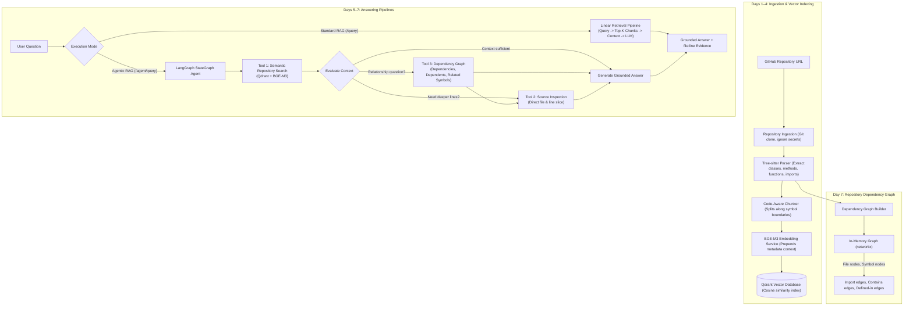

# RepoPilot — Agentic RAG-Based GitHub Repository Onboarding Assistant

RepoPilot is an AI-powered repository understanding and onboarding system. It ingests public GitHub repositories, analyzes code structure using Tree-sitter, chunks along AST symbol boundaries, embeds code with `BAAI/bge-m3`, stores dense vectors in Qdrant, builds a **dependency graph** of repository relationships, and orchestrates repository investigations using **LangGraph** to produce grounded answers backed by line-level evidence.

---

## Architecture: Days 1–7



---

## Day 7: Repository Dependency Graph

### Why a Dependency Graph?

Semantic retrieval finds relevant code based on meaning — for example, searching for "authentication" retrieves `AuthService`. However, semantic search alone does not understand **explicit structural relationships** between files and symbols.

The dependency graph captures:
- **Import relationships**: which files import which other files
- **Symbol containment**: which classes, functions, and methods are defined in which files
- **Class hierarchy**: which methods belong to which classes

This allows the agent to **follow relationships** across the codebase:

```
Semantic Retrieval
"What handles login?"
        ↓
AuthController

Graph Investigation
AuthController
      ↓ imports
AuthService
      ↓ imports
UserRepository
```

Combining semantic retrieval with structural relationships helps the agent investigate a codebase more systematically, discovering connected code that pure embedding similarity might miss.

### Graph Structure

The graph is built during repository ingestion from Tree-sitter parse results:

| Node Type | Example |
|-----------|---------|
| `file` | `app/auth/service.py` |
| `class` | `AuthService` |
| `function` | `hash_password` |
| `method` | `AuthService.login` |

| Edge Type | Meaning |
|-----------|---------|
| `imports` | File A imports File B |
| `contains` | File contains a symbol |
| `defined_in` | Class contains a method |

### Graph Queries

| Query | Description |
|-------|-------------|
| `get_dependencies(file)` | Files this file imports |
| `get_dependents(file)` | Files that import this file |
| `get_related_symbols(name)` | Symbols matching a name across the repo |
| `get_neighbors(node)` | All directly connected nodes |
| `get_import_chain(file)` | Multi-hop import traversal |

### Example Investigation

**Question**: `"How does the login request reach the database?"`

```
LangGraph Agent
    ↓
Semantic Search → finds AuthController, AuthService
    ↓
Graph Investigation → discovers:
    AuthController imports AuthService
    AuthService imports UserRepository
    ↓
Source Inspection → reads relevant lines
    ↓
Grounded Answer with full dependency chain
```

---

## Day 6: LangGraph Agentic Orchestration

### Why LangGraph Was Added
On Day 5, RepoPilot used a deterministic, one-shot RAG pipeline: every question unconditionally retrieved a fixed number of chunks and called the LLM.

However, real-world repository exploration requires **agentic orchestration**:
1. Some questions are simple and need only top-ranked chunks.
2. Other questions reference larger methods, partial split chunks, or specific surrounding context lines that require targeted source file inspection.
3. If retrieval finds no relevant code, the agent should immediately recognize insufficient context rather than hallucinating answers.
4. Questions about code relationships benefit from structural graph investigation before answering.

LangGraph provides a cyclic state machine (`StateGraph`) that makes this decision-making process explicit, observable, and bounded.

### Normal RAG vs. Agentic RAG

| Aspect | Standard RAG (`/query`) | Agentic RAG (`/agent/query`) |
|---|---|---|
| **Pipeline Flow** | Fixed, static single-pass | Dynamic state machine (`StateGraph`) |
| **Tool Usage** | Implicit single retrieval | Explicit tool execution (`tools_used` trace) |
| **Source Inspection** | None (only indexed chunks) | Can inspect exact file & line boundaries on disk |
| **Graph Investigation** | None | Can follow import chains and discover related symbols |
| **Adaptability** | Treats all queries identically | Evaluates whether context suffices or needs expansion |

### Agent State (`AgentState`)
The agent maintains a minimal, observable state:
```python
class AgentState(TypedDict, total=False):
    question: str                         # User's question
    top_k: int                            # Retrieval limit
    retrieved_chunks: list[dict[str, Any]] # Chunks from semantic search
    evidence: list[dict[str, Any]]        # Structured file:start-end citations
    tools_used: list[str]                 # History of invoked tools
    source_inspections: list[dict[str, Any]] # Raw snippets from file inspection
    graph_investigations: list[dict[str, Any]] # Results from dependency graph queries
    needs_more_investigation: bool        # Decision from context evaluation
    needs_graph_investigation: bool       # Decision from context evaluation
    target_inspection: dict[str, Any] | None # File/lines for next inspection
    investigation_status: str             # "searching" | "evaluating" | "investigating_graph" | "inspecting" | "completed" | "insufficient"
    answer: str                           # Grounded response text
    iteration: int                        # Safeguard counter (max 1 inspection step)
```

### Available Tools
1. **Semantic Repository Search (`SemanticSearchTool`)**:
   - Reuses the existing BGE-M3 + Qdrant pipeline via `Retriever`.
   - Embeds natural-language questions and retrieves top-K code chunks with cosine similarity scores and metadata.
2. **Source Inspection Tool (`SourceInspectionTool`)**:
   - Safely reads raw repository source files directly from `data/repositories/`.
   - Extracts specific 1-indexed line spans (e.g. lines 20–45 of `auth/service.py`) without path traversal vulnerabilities.
3. **Dependency Graph Tool (`DependencyGraphTool`)**:
   - Queries the in-memory dependency graph built during ingestion.
   - Finds dependencies (imports), dependents (imported by), related symbols, neighbors, and import chains.

### Example Investigation Process
**Question**: `"How does the login request reach the database?"`
1. **Node `decide_initial_action`**: Validates input question and initializes state.
2. **Node `repository_search`**: Calls `SemanticSearchTool`, retrieves top chunks.
3. **Node `evaluate_context`**: Detects relationship keywords ("reach", "flow"). Sets `needs_graph_investigation = True`.
4. **Node `graph_investigation`**: Calls `DependencyGraphTool` to discover imports and dependents of top files. Records `"graph_investigation"` in `tools_used`.
5. **Node `generate_answer`**: Merges semantic chunks, graph relationships, and any inspected code into RAG context, invokes LLM with strict anti-hallucination prompt, outputs grounded answer and citations.

---

## Interview Explanation

> *"Days 1–5 built a linear RAG pipeline: ingest, embed, retrieve, answer. Day 6 introduced LangGraph so the system can orchestrate multi-step investigation as a stateful workflow. Day 7 added a lightweight dependency graph built from the same Tree-sitter parse results, so the agent can follow import chains and discover related symbols — combining semantic similarity with explicit structural relationships for more systematic codebase exploration."*

---

## API Endpoints

### 1. Ingest Repository
`POST /repository/analyze`
```json
{
  "github_url": "https://github.com/pallets/click"
}
```
Response now includes `graph_nodes` and `graph_edges` counts.

### 2. Repository Dependency Graph (Day 7)
`GET /repository/graph`

Returns the graph as JSON nodes and edges:
```json
{
  "nodes": [
    {"id": "app/auth/service.py", "node_type": "file", "label": "service.py", "language": "Python"},
    {"id": "app/auth/service.py::AuthService", "node_type": "class", "name": "AuthService", ...}
  ],
  "edges": [
    {"source": "app/auth/service.py", "target": "app/db/repository.py", "edge_type": "imports"},
    {"source": "app/auth/service.py", "target": "app/auth/service.py::AuthService", "edge_type": "contains"}
  ],
  "stats": {"total_nodes": 42, "total_edges": 38, "file_nodes": 12, "symbol_nodes": 30}
}
```

### 3. Standard RAG Query (Day 5)
`POST /query`
```json
{
  "query": "Where is authentication implemented?",
  "top_k": 5
}
```

### 4. Agentic RAG Query with LangGraph (Days 6–7)
`POST /agent/query`
```json
{
  "query": "How does the login request reach the database?",
  "top_k": 5
}
```
**Response**:
```json
{
  "question": "How does the login request reach the database?",
  "answer": "The login request flows from AuthController through AuthService to UserRepository...",
  "evidence": [
    {
      "file": "app/controllers/auth_controller.py",
      "symbol": "AuthController",
      "start_line": 3,
      "end_line": 8,
      "citation": "app/controllers/auth_controller.py:3-8",
      "score": 0.95
    }
  ],
  "tools_used": ["semantic_search", "graph_investigation"],
  "investigation_status": "completed",
  "graph_investigations": [
    {
      "file": "app/auth/service.py",
      "dependencies": ["app/db/repository.py", "app/utils.py"],
      "symbols": [{"name": "AuthService", "type": "class", "lines": "4-11"}]
    }
  ],
  "retrieved_chunks": [...],
  "source_inspections": [...]
}
```

### 5. Direct Chunk Retrieval
`POST /retrieve`
```json
{
  "query": "login token",
  "top_k": 3
}
```

---

## Installation & Setup

### 1. Backend Setup
```powershell
python -m venv .venv
.venv\Scripts\activate
pip install -r backend/requirements.txt
```

### 2. Start Backend API
```powershell
python -m uvicorn backend.app.main:app --reload --port 8000
```
Swagger API docs available at `http://127.0.0.1:8000/docs`.

### 3. Start Frontend Dashboard
```powershell
cd frontend
npm install
npm run dev
```
Open `http://localhost:5173` in your browser.

---

## Running Automated Tests

Run the full suite of **88 unit and pipeline tests**:
```powershell
pytest
```
- `test_graph.py`: 39 tests verifying dependency graph construction, queries, tool wrapper, agent integration, and API endpoint
- `test_agent.py`: 9 tests verifying LangGraph execution, tool routing, and grounding
- `test_rag.py`: 16 tests verifying Day 5 retrieval, evidence, and grounded generation
- `test_embeddings.py`: 8 tests verifying BGE-M3 query and chunk encoding
- `test_qdrant_store.py`: 6 tests verifying vector indexing and cosine search
- `test_parser.py`: 5 tests verifying Tree-sitter AST symbol discovery
- `test_repository.py`: 5 tests verifying Git cloning and secret exclusion
